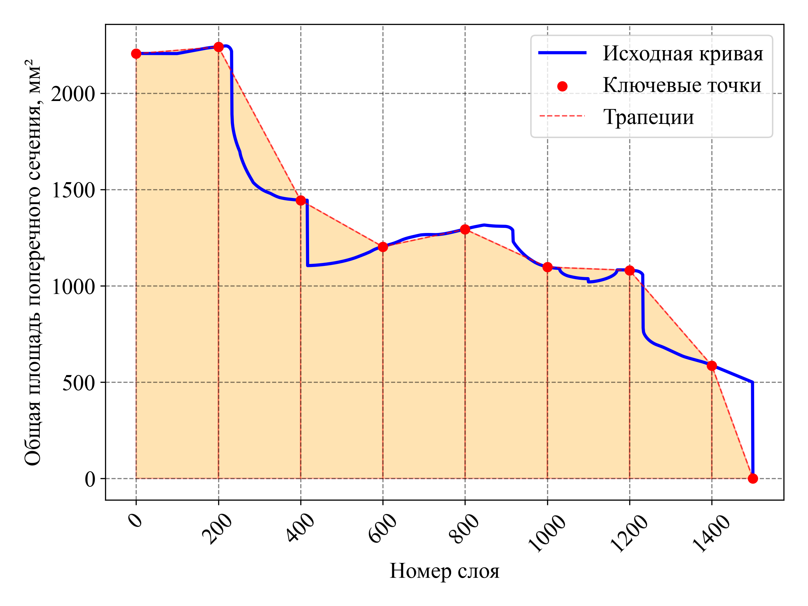

Вот переведённая версия файла `README.md` на русский язык:

---

# **Оценка времени печати в СЛС**

## **Обзор**
Этот репозиторий содержит инструменты и скрипты для оценки времени печати любых изделий по технологии **Селективного лазерного сплавления (СЛС)** металло-порошковых композиций. Оценка основана на реальных измерениях, выполненных с использованием пилотного лазера без фактического плавления материала.

## **Функциональные возможности**
- Разбор лог-файлов с данными измерений.
- Обработка изменений площади поперечного сечения по слоям.
- Оценка суммарного времени изготовления.
- Сравнение рассчитанного и реального времени изготовления.

## **Использование**
1. **Обработка данных**:
   - Лог-файлы (`tables/*.log`) содержат сырые данные измерений.
   - `logsParser.py` извлекает релевантную информацию.
   - `spec_func.py` обрабатывает поперечные сечения и рассчитывает время изготовления.

2. **Анализ в Jupyter Notebook**:
   - `2025.02.10 - Ecolibry.ipynb` – анализ изменения площади поперечного сечения на примере реального проекта.
   - `2025.02.10 - TimeEval.ipynb` – оценка времени и валидация данных в общем.

3. **Визуализация**:
   - Следующие графики иллюстрируют различные этапы анализа:

### **Графики и анализ**

#### **1. Изменение площади поперечного сечения по слоям**
Изменение площади поперечного сечения в процессе печати.

#### **2. Оценка суммарного времени изготовления vs. Реальные измерения**
Сравнение рассчитанного суммарного времени изготовления с реальными измерениями.

#### **3. Изменение площади поперечного сечения с фиксированными точками**
На этой визуализации показаны фиксированные точки, использованные для интерполяции.

#### **4. Трапецеидальная аппроксимация площади поперечного сечения**
Метод ресемплирования для расчёта времени изготовления.

#### **5. Реальное vs. Расчётное время изготовления слоев**
Разница между оценочным и фактическим временем изготовления отдельных слоев.

## **Вклад в проект**
Вы можете предложить улучшения, создать issue или отправить pull request для расширения функциональности.

## **Лицензия**
Этот проект распространяется под лицензией MIT.