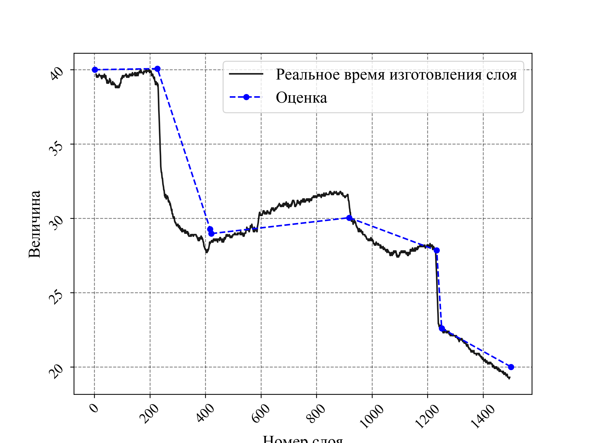

# LPBF Time Estimation

## Overview
This repository provides tools and scripts for estimating the processing time of Laser Powder Bed Fusion (LPBF) metal 3D printing. The estimation is based on real measurement data collected from a pilot laser system operating without real emission.

## Features
- Parses and processes experimental log files containing laser movement data.
- Estimates printing time based on pilot laser movements.
- Provides visualization and analysis of estimated times.

## Repository Structure
```
LPBF_TimeEstimation-main/
│-- notebooks/
│   ├── 2025.02.10 - Ecolibry.ipynb    # Jupyter Notebook for Ecolibry-based analysis
│   ├── 2025.02.10 - TimeEval.ipynb    # Jupyter Notebook for general time evaluation
│
│-- scripts/
│   ├── logsParser.py    # Script for parsing log files
│   ├── spec_func.py     # Contains specific functions used in time estimation
│
│-- tables/
│   ├── *.log            # Log files with recorded laser movement data
│
│-- figures/
│   ├── *.png            # Generated figures and plots
│
│-- README.md            # Project documentation
```

## Installation
1. Clone the repository:
   ```sh
   git clone https://github.com/your-username/LPBF_TimeEstimation.git
   cd LPBF_TimeEstimation
   ```
2. Install required dependencies:
   ```sh
   pip install -r requirements.txt
   ```

## Usage
### Running Jupyter Notebooks
To analyze data and visualize results, open the notebooks:
```sh
jupyter notebook
```
Select one of the provided notebooks (`Ecolibry.ipynb` or `TimeEval.ipynb`) and run the cells step by step.

### Parsing Log Files
To parse and extract useful data from log files, run:
```sh
python scripts/logsParser.py tables/your_log_file.log
```

### Running Time Estimation Functions
You can use `spec_func.py` to apply custom estimation functions. Import the module and use predefined functions as needed:
```python
from scripts.spec_func import your_function
result = your_function(parameters)
```

You're right! Since the images are stored in the `./figures` directory within the repository, I should reference them correctly in the `README.md`. I'll update the file to point to the correct paths.

Here’s the corrected version:

---

# **LPBF Time Estimation Project**

## **Overview**
This repository provides tools and scripts for estimating the time required for Laser Powder Bed Fusion (LPBF) metal 3D printing. The estimation is based on real measurements performed using a pilot laser, without actual material emission.

## **Features**
- Parsing log files containing measurement data.
- Processing cross-sectional area variations through layers.
- Estimating cumulative manufacturing time.
- Comparing estimated and actual manufacturing times.

## **Installation**
To use the scripts and notebooks, install the required dependencies using:

```bash
pip install -r requirements.txt
```

Alternatively, if using Poetry:

```bash
poetry install
```

## **Usage**
1. **Data Processing**:
   - Log files (`tables/*.log`) contain raw measurements.
   - `logsParser.py` extracts relevant information.
   - `spec_func.py` processes cross-sectional areas and estimates manufacturing time.

2. **Analysis Notebooks**:
   - `2025.02.10 - Ecolibry.ipynb` – Analysis of cross-sectional areas.
   - `2025.02.10 - TimeEval.ipynb` – Time estimation and validation.

3. **Visualization**:
   - The following figures illustrate different aspects of the analysis:

### **Figures and Analysis**

#### **1. Cross-Sectional Area Change per Layer**
This plot shows how the cross-sectional area evolves throughout the printing process.


#### **2. Cumulative Time Estimation vs. Actual Time**
The estimated cumulative manufacturing time is compared against real measurements.


#### **3. Layer-Based Area Change with Fix Points**
This visualization includes fix points used for interpolation.


#### **4. Trapezoidal Approximation for Cross-Sectional Area**
A resampling method for calculating manufacturing time.


#### **5. Real vs. Estimated Layer Manufacturing Time**
The difference between the estimated and real time for individual layers.



## Contributing
Feel free to submit issues, suggestions, or pull requests to enhance functionality.

## License
This project is licensed under the MIT License.

